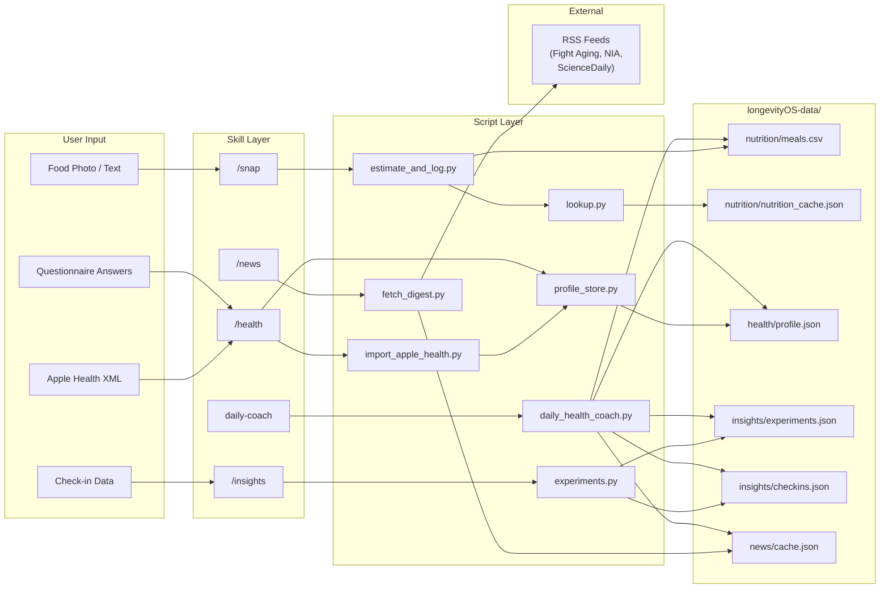
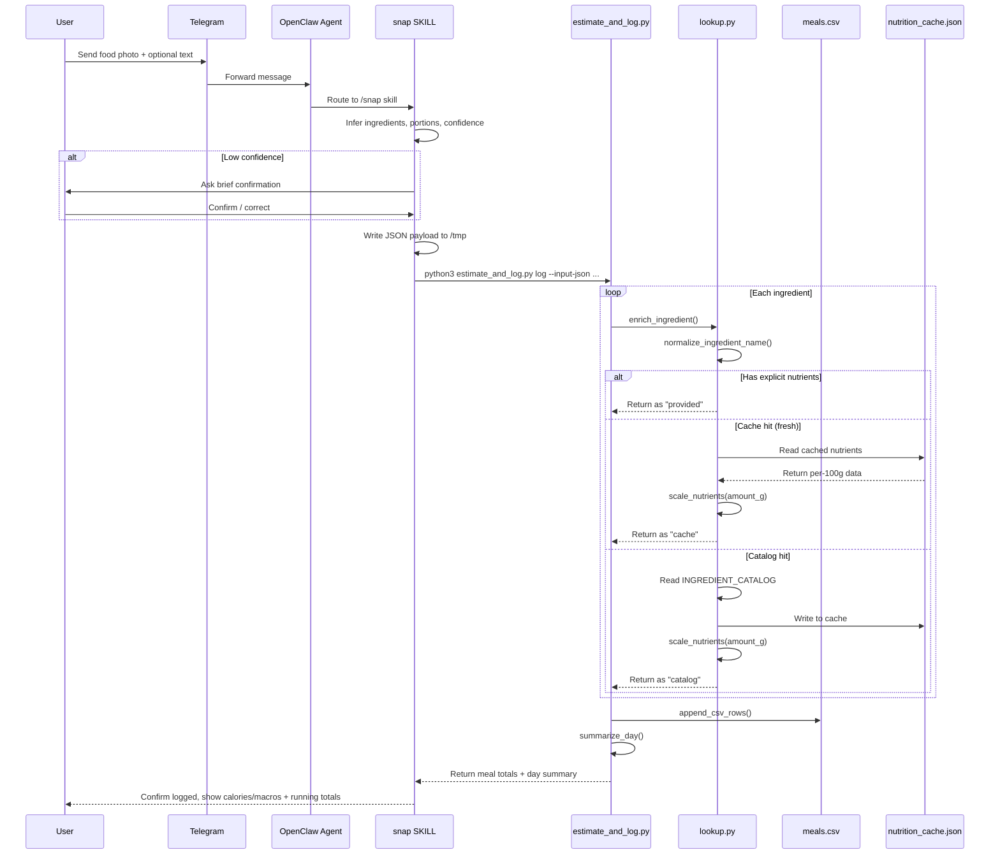
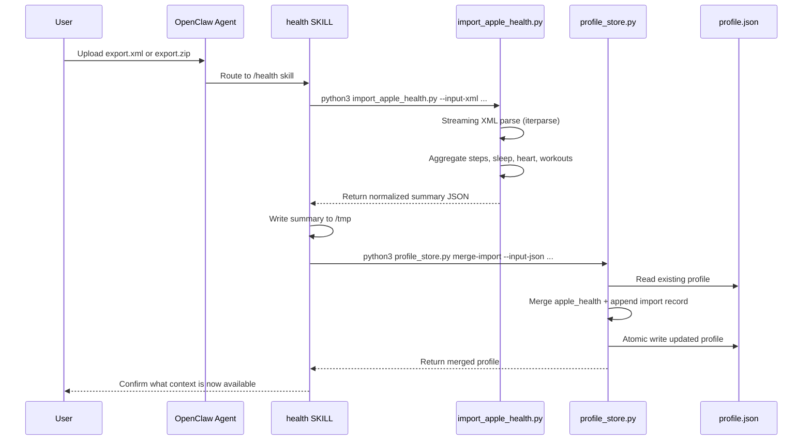
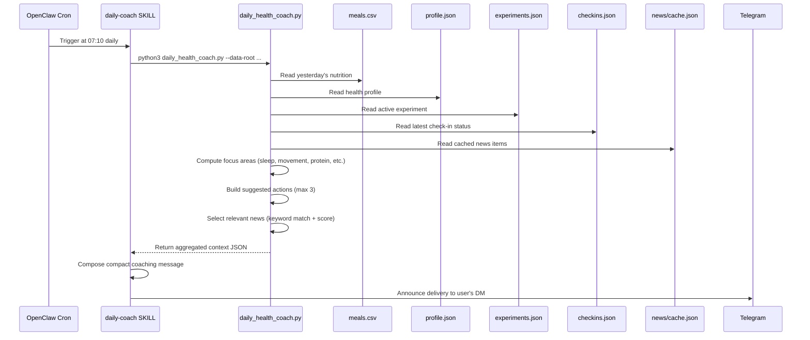
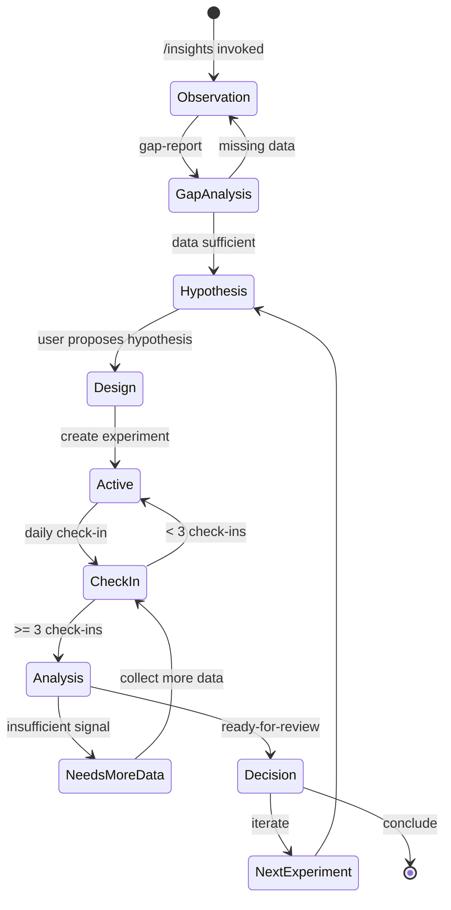
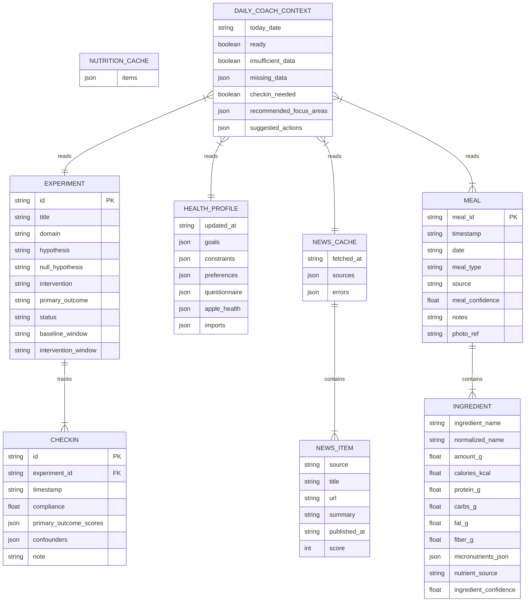

<a id="top"></a>

# compound-clawskill

OpenClaw skill bundle for a personal health companion.

It currently provides:

- `/snap` for meal logging from food photos or meal text, using ingredient/portion inference plus deterministic nutrition enrichment
- `/health` for Apple Health XML import and structured health profile updates
- `/news` for a curated health/longevity digest
- `/insights` for structured self-experiments and gap-aware recommendations
- a cron-driven daily health coach that combines local health data, experiment context, and relevant curated news into personalized daily guidance

The bundle is designed for OpenClaw + Telegram and installs as a managed bundle under `~/.openclaw/bundles/compound-clawskill`.

## Core Features

- `/snap` turns food photos or meal descriptions into structured meal logs. The agent identifies likely ingredients and portions, asks for confirmation when confidence is low, and records an ingredient-level meal entry instead of a vague free-text note.
- Nutrition logging is backed by deterministic enrichment code rather than fully model-invented numbers. Ingredient names are normalized to canonical forms, nutrient values are filled from local nutrition data and cache, and the stored rows record where those values came from.
- `/health` builds a reusable health profile from Apple Health exports and structured questionnaire-style inputs. That profile becomes shared context for future recommendations instead of forcing the user to restate the same baseline every time.
- `/news` produces a curated digest focused on health, longevity, nutrition, sleep, exercise, and related research, using predefined sources instead of generic open-ended news search.
- `/insights` is designed for structured self-experimentation. It tracks hypotheses, interventions, check-ins, and follow-up analysis, and it is intentionally allowed to say “not enough data yet” instead of pretending to know the answer.
- Morning automation is supported through separate cron-driven health brief, news digest, and daily coach messages, so the system can proactively summarize, curate, and coach instead of waiting for the user to ask each time.
- Everything is local-first. Runtime state lives under `longevityOS-data/`, which keeps meal logs, health profile data, experiment state, and cached news separate from unrelated OpenClaw workspace data.

[Back to top](#top)

## Table Of Contents

- [Core Features](#core-features)
- [Architecture](#architecture)
  - [Overall Architecture Diagram](#overall-architecture-diagram)
  - [Subsystem Breakdown](#subsystem-breakdown)
  - [Data Flow Diagram](#data-flow-diagram)
  - [Snap Meal Logging Sequence](#snap-meal-logging-sequence)
  - [Health Import Sequence](#health-import-sequence)
  - [Daily Coach Cron Sequence](#daily-coach-cron-sequence)
  - [Experiment Lifecycle State Machine](#experiment-lifecycle-state-machine)
  - [Domain Entity Model](#domain-entity-model)
  - [Architectural Boundaries And Handoff Points](#architectural-boundaries-and-handoff-points)
- [Copy And Paste To Your OpenClaw To Install (Recommended)](#copy-and-paste-to-your-openclaw-to-install-recommended)
- [Install](#install)
- [Install Verification](#install-verification)
- [Fresh Session Required](#fresh-session-required)
- [Telegram Command Note](#telegram-command-note)
- [Apple Health Import](#apple-health-import)
- [Cron Setup](#cron-setup)
- [Smoke Test](#smoke-test)
- [Uninstall](#uninstall)
- [Runtime Data](#runtime-data)
- [Data Shapes](#data-shapes)
- [Development](#development)
- [Repo Layout](#repo-layout)
- [Docs](#docs)

## Architecture

### Overall Architecture Diagram

How the user, Telegram, OpenClaw, skills, scripts, and local storage connect end-to-end.

```
 +-----------+       +----------+       +-------------------+
 |           | msg / |          | skill |    OpenClaw        |
 |   User    +------>+ Telegram +------>+    Agent Loop      |
 |           | photo |          |       |                    |
 +-----------+       +----------+       +--------+----------+
                          ^                      |
                          |  announce             | invokes
                          |  delivery             v
                     +----+----+        +---------+---------+
                     |  Cron   |        |   Skill Layer     |
                     | Scheduler|       | (SKILL.md files)  |
                     +---------+        |                   |
                     | 07:00 brief      | snap   health     |
                     | 07:05 news       | news   insights   |
                     | 07:10 coach      | daily-coach       |
                     +---------+        +---------+---------+
                                                  |
                                                  | shell exec
                                                  v
                                        +---------+---------+
                                        |  Script Layer     |
                                        |  (Python scripts) |
                                        |                   |
                                        | nutrition/        |
                                        | health/           |
                                        | news/             |
                                        | insights/         |
                                        | coach/            |
                                        | common/           |
                                        +---------+---------+
                                                  |
                                                  | read/write
                                                  v
                                        +---------+---------+
                                        |  Data Layer       |
                                        | longevityOS-data/ |
                                        |                   |
                                        | nutrition/meals.csv
                                        | health/profile.json
                                        | insights/*.json   |
                                        | news/cache.json   |
                                        +-------------------+
```

This shows the three-layer architecture: skills define agent behavior, scripts own deterministic logic and I/O, and `longevityOS-data/` is the single source of truth for all runtime state.

[Back to top](#top)

### Subsystem Breakdown

Each subsystem, what it owns, what it depends on, and what contracts it exposes.

```
+-------------------------------------------------------------------+
|                        SKILL LAYER                                |
|  (prompt-driven, defines agent behavior for each command)         |
+-------------------------------------------------------------------+
|                                                                   |
|  snap/SKILL.md        health/SKILL.md      news/SKILL.md         |
|  - owns: meal UX      - owns: profile UX   - owns: digest UX    |
|  - calls: estimate_   - calls: profile_     - calls: fetch_      |
|    and_log.py            store.py, import_    digest.py           |
|                          apple_health.py                          |
|                                                                   |
|  insights/SKILL.md    daily-coach/SKILL.md                        |
|  - owns: experiment   - owns: morning                             |
|    lifecycle UX         coaching UX                                |
|  - calls:             - calls:                                    |
|    experiments.py       daily_health_                              |
|                         coach.py                                  |
+-------------------------------------------------------------------+
|                       SCRIPT LAYER                                |
+-------------------------------------------------------------------+
|                                                                   |
|  scripts/nutrition/          scripts/health/                      |
|  +- estimate_and_log.py     +- import_apple_health.py            |
|  |  (log, summary)          |  (streaming XML parse)             |
|  +- lookup.py               +- profile_store.py                  |
|  |  (normalize, enrich,     |  (merge-questionnaire,             |
|  |   catalog, cache)        |   merge-import, show)              |
|  +- daily_summary.py        |                                    |
|                              |                                    |
|  scripts/news/               scripts/insights/                    |
|  +- fetch_digest.py         +- experiments.py                    |
|     (fetch RSS, score,         (create, checkin,                  |
|      rank, cache)               analyze, gap-report)             |
|                                                                   |
|  scripts/coach/              scripts/common/                      |
|  +- daily_health_coach.py   +- paths.py (repo_root, data_root)  |
|     (aggregate all data,    +- storage.py (JSON/CSV I/O,         |
|      focus areas, actions,      atomic writes)                    |
|      relevant news)                                               |
+-------------------------------------------------------------------+
|                        DATA LAYER                                 |
+-------------------------------------------------------------------+
|  longevityOS-data/                                                |
|  +- nutrition/meals.csv         (ingredient-centric meal log)     |
|  +- nutrition/nutrition_cache.json  (deterministic lookup cache)  |
|  +- health/profile.json        (merged health profile)           |
|  +- insights/experiments.json   (experiment definitions)          |
|  +- insights/checkins.json      (experiment check-ins)            |
|  +- news/cache.json             (latest curated digest)           |
+-------------------------------------------------------------------+
```

[Back to top](#top)

### Data Flow Diagram

How data moves between subsystems during daily operation.



This shows how each user input flows through its skill, into the deterministic script layer, and lands in a specific data store. The daily coach reads across all stores to produce its aggregated output.

[Back to top](#top)

### Snap Meal Logging Sequence

The full sequence from photo to stored CSV row with running totals.



This shows how ingredient enrichment cascades through three sources (provided, cache, catalog) and why every stored row records its `nutrient_source`.

[Back to top](#top)

### Health Import Sequence

From Apple Health XML export to merged profile.



This shows the two-step import: first the XML is parsed and summarized, then the summary is merged into the persistent profile.

[Back to top](#top)

### Daily Coach Cron Sequence

How the morning cron job aggregates all subsystem data into a coaching message.



This shows the daily coach as a cross-cutting aggregator: it reads from nutrition, health, insights, and news stores to produce a single personalized message.

[Back to top](#top)

### Experiment Lifecycle State Machine

The phases an `/insights` experiment moves through.



This shows why the system refuses to give strong recommendations early: it enforces a minimum evidence gate (3 check-ins) before allowing analysis review, and explicitly returns "needs-more-data" when the signal is insufficient.

[Back to top](#top)

### Domain Entity Model

The core entities and their relationships.



This shows the six core entities. Meals are ingredient-centric (one meal produces many rows). Experiments track check-ins over time. The daily coach context is a read-only aggregate built from all other entities.

[Back to top](#top)

### Architectural Boundaries And Handoff Points

Where the responsibility boundaries are drawn between layers.

```
BOUNDARY MAP
============

                    +-----------------------+
                    |   AGENT BOUNDARY      |
                    |                       |
                    | The OpenClaw agent    |
                    | owns all natural      |
                    | language I/O, photo   |
                    | understanding, and    |
                    | confidence decisions. |
                    |                       |
                    | It produces structured |
                    | JSON payloads.        |
                    +-----------+-----------+
                                |
                    JSON payload via /tmp file
                                |
                    +-----------v-----------+
                    |   SKILL BOUNDARY      |
                    |                       |
                    | SKILL.md files define  |
                    | WHEN to call scripts  |
                    | and WHAT payload      |
                    | shape to produce.     |
                    |                       |
                    | Skills never write    |
                    | to storage directly.  |
                    +-----------+-----------+
                                |
                    shell exec: python3 script.py --args
                                |
                    +-----------v-----------+
                    |   SCRIPT BOUNDARY     |
                    |                       |
                    | Python scripts own    |
                    | ALL deterministic     |
                    | logic: normalization, |
                    | enrichment, scoring,  |
                    | aggregation, and      |
                    | storage I/O.          |
                    |                       |
                    | Scripts never call    |
                    | the model or make     |
                    | confidence decisions. |
                    +-----------+-----------+
                                |
                    atomic JSON write / CSV append
                                |
                    +-----------v-----------+
                    |   DATA BOUNDARY       |
                    |                       |
                    | longevityOS-data/ is  |
                    | the single source of  |
                    | truth.                |
                    |                       |
                    | CSV for append-heavy  |
                    | nutrition logs.       |
                    | JSON for profile,     |
                    | experiments, cache.   |
                    |                       |
                    | All writes go through |
                    | scripts/common/       |
                    | storage.py helpers    |
                    | (atomic temp+rename). |
                    +-----------------------+

HANDOFF CONTRACTS:

  Agent -> Skill:    Natural language + routing decision
  Skill -> Script:   Structured JSON via temp file + CLI args
  Script -> Data:    Atomic file writes via storage.py
  Data -> Script:    Direct file reads via storage.py
  Script -> Skill:   JSON stdout
  Skill -> Agent:    Structured result for response composition
  Cron -> Skill:     Scheduled trigger with agentTurn payload
  Coach -> Telegram:  Announce delivery to DM chat ID
```

This boundary design means the model handles ambiguity (language, photos, confidence), skills handle orchestration (when and what to call), scripts handle correctness (deterministic enrichment and storage), and data handles durability (local-first files with atomic writes).

[Back to top](#top)

## Copy And Paste To Your OpenClaw To Install (Recommended)

Use the following block as a copy-paste instruction for an OpenClaw agent that should install this bundle on the user's device:

```text
1. Clone `https://github.com/compound-life-ai/longClaw` to a stable local path.
2. Change into the cloned repository.
3. Run `python3 scripts/install_bundle.py`.
4. Run `python3 scripts/install_bundle.py --verify`.
5. Confirm that `~/.openclaw/openclaw.json` includes the installed bundle `skills/` path inside `skills.load.extraDirs`.
6. Tell the user to start a new OpenClaw session.
7. Tell the user to verify that `/snap`, `/health`, `/news`, and `/insights` are available and usable.
8. Tell the user to verify that `daily-coach` is loaded with `openclaw skills info daily-coach`.
9. If needed, tell the user to configure the cron templates from the installed `cron/` directory with their Telegram DM chat id, including `cron/daily-health-coach.example.json` for proactive daily coaching.
```

[Back to top](#top)

## Install

Preview the install:

```bash
python3 scripts/install_bundle.py --dry-run
```

Install into the default OpenClaw home:

```bash
python3 scripts/install_bundle.py
```

Install into a custom OpenClaw home:

```bash
python3 scripts/install_bundle.py --openclaw-home /path/to/.openclaw
```

Verify the installed bundle:

```bash
python3 scripts/install_bundle.py --verify
```

The installer:

- copies `skills/`, `scripts/`, `cron/`, and `docs/`
- initializes `longevityOS-data/`
- registers the installed `skills/` directory in `skills.load.extraDirs`

[Back to top](#top)

## Install Verification

Checking `openclaw.json` is necessary, but not sufficient.

After install, verify config:

```bash
python3 - <<'PY'
import json, pathlib
p = pathlib.Path.home()/'.openclaw'/'openclaw.json'
obj = json.loads(p.read_text())
print(obj.get('skills', {}).get('load', {}).get('extraDirs', []))
PY
```

Then verify OpenClaw sees the skills as real ready skills:

```bash
openclaw skills info snap
openclaw skills info health
openclaw skills info news
openclaw skills info insights
openclaw skills info daily-coach
```

Expected result:

- each skill shows `Ready`

[Back to top](#top)

## Fresh Session Required

OpenClaw snapshots eligible skills at session start. After installation, start a fresh OpenClaw session before testing commands. Staying in an older session can make command behavior look stale or inconsistent.

[Back to top](#top)

## Telegram Command Note

With `commands.native = "auto"` and `commands.nativeSkills = "auto"`, OpenClaw should expose user-invocable skills as native Telegram commands.

Two separate things can happen:

- typed commands like `/snap` work
- commands appear in Telegram's slash picker/menu

Telegram may hide some commands when the menu is crowded. If a command does not appear in the picker, try typing it manually first.

[Back to top](#top)

## Apple Health Import

The health importer accepts either:

- `export.xml`
- `export.zip`

If Apple Health gives you `export.zip`, you can import the zip directly now, or extract `apple_health_export/export.xml` first.

Examples:

```bash
python3 scripts/health/import_apple_health.py --input-zip ~/Downloads/export.zip
python3 scripts/health/import_apple_health.py --input-xml /path/to/apple_health_export/export.xml
```

[Back to top](#top)

## Cron Setup

The templates are not usable until you replace `__TELEGRAM_DM_CHAT_ID__`.

Files:

- `cron/health-brief.example.json`
- `cron/news-digest.example.json`
- `cron/daily-health-coach.example.json`

Then create the jobs:

```bash
openclaw cron add --from-file cron/health-brief.example.json
openclaw cron add --from-file cron/news-digest.example.json
openclaw cron add --from-file cron/daily-health-coach.example.json
```

[Back to top](#top)

## Smoke Test

After install:

1. Start a new OpenClaw session.
2. Run `/news`.
3. Test `/snap` with a food photo.
4. Run `/health`.
5. Run `/insights`.
6. Configure and enable `cron/daily-health-coach.example.json` if you want the personalized daily coach message.

[Back to top](#top)

## Uninstall

To remove the installed bundle:

1. Remove any cron jobs you created from `cron/health-brief.example.json`, `cron/news-digest.example.json`, and `cron/daily-health-coach.example.json`.
2. Remove `~/.openclaw/bundles/compound-clawskill/skills` from `skills.load.extraDirs` in `~/.openclaw/openclaw.json`.
3. Delete `~/.openclaw/bundles/compound-clawskill` to remove the installed skills, copied files, and `longevityOS-data/`.
4. Start a fresh OpenClaw session.

[Back to top](#top)

## Runtime Data

Runtime data is namespaced under:

```text
longevityOS-data/
  nutrition/
  health/
  insights/
  news/
```

This keeps the bundle’s state separate from unrelated workspace data.

[Back to top](#top)

## Data Shapes

There is no separate schema file yet. The current storage contract is defined by the Python scripts in `scripts/`.

### Nutrition

Path:

- `longevityOS-data/nutrition/meals.csv`

This is ingredient-centric, not meal-centric. One meal can produce multiple rows that share the same `meal_id`.

CSV columns:

- `timestamp`
- `date`
- `meal_id`
- `meal_type`
- `source`
- `ingredient_name`
- `normalized_name`
- `amount_g`
- `portion_text`
- `calories_kcal`
- `protein_g`
- `carbs_g`
- `fat_g`
- `fiber_g`
- `micronutrients_json`
- `nutrient_source`
- `ingredient_confidence`
- `meal_confidence`
- `notes`
- `photo_ref`

`micronutrients_json` is a JSON object serialized into a CSV cell, for example:

```json
{
  "selenium_mcg": 54,
  "vitamin_d_mcg": 16.35
}
```

`normalized_name` stores the canonical ingredient key used by the deterministic lookup layer.

`amount_g` stores the explicit or inferred gram amount used to scale per-100g nutrient values.

`nutrient_source` currently records where the row’s nutrients came from:

- `provided`
- `catalog`
- `cache`

Current `/snap` flow:

- the model identifies likely ingredients and rough portions from meal text or a food photo
- the nutrition script normalizes ingredient names to canonical keys
- the script enriches macros and micronutrients deterministically from the local nutrition catalog or cache when explicit nutrient values are not provided
- if the user supplies trustworthy label-style values or an exact recipe, those values are preserved with `nutrient_source = provided`

Current limitations:

- live USDA FoodData Central lookup is not implemented yet
- live Open Food Facts fallback is not implemented yet
- recipe-library-first reuse is not implemented yet

### Health Profile

Path:

- `longevityOS-data/health/profile.json`

Top-level shape:

```json
{
  "updated_at": "2026-03-19T05:22:15+00:00",
  "goals": ["better sleep"],
  "constraints": ["no late caffeine"],
  "preferences": {
    "language": "bilingual"
  },
  "questionnaire": {
    "sleep_notes": "wake up once",
    "training_notes": "hard sessions on Tue/Thu",
    "diet_notes": "more protein"
  },
  "apple_health": {},
  "imports": [
    {
      "source": "apple_health_export_xml",
      "imported_at": "2026-03-19T05:22:15+00:00",
      "file_name": "export.xml"
    }
  ]
}
```

`apple_health` stores the normalized importer summary, currently shaped like:

```json
{
  "imported_at": "2026-03-19T05:22:15+00:00",
  "source": "apple_health_export_xml",
  "file_name": "export.xml",
  "counts": {
    "records": 3170057,
    "workouts": 544,
    "days_with_steps": 1745,
    "days_with_sleep": 1338
  },
  "activity": {
    "daily_steps_avg": 9740,
    "daily_active_energy_kcal_avg": 393.53,
    "daily_basal_energy_kcal_avg": 1686.23,
    "daily_exercise_minutes_avg": 31.94,
    "daily_walking_running_distance_avg_km": 6.91,
    "daily_cycling_distance_avg_km": 2.93,
    "step_days": 1745
  },
  "sleep": {
    "daily_sleep_hours_avg": 6.32,
    "sleep_days": 1338,
    "daily_sleep_hours_values": [5.95, 5.09, 7.46]
  },
  "heart": {
    "resting_heart_rate_avg": 63.17,
    "heart_rate_avg": 92.12,
    "walking_heart_rate_avg": 99.29,
    "heart_rate_variability_sdnn_avg": 42.91,
    "oxygen_saturation_avg": 0.96,
    "respiratory_rate_avg": 15.9,
    "vo2_max_avg": 45.6,
    "sample_count": 734625
  },
  "workouts": {
    "workout_count": 544,
    "average_workout_minutes": 27.03,
    "by_type": {
      "HKWorkoutActivityTypeRunning": 66,
      "HKWorkoutActivityTypeCycling": 117
    }
  }
}
```

### Insights

Paths:

- `longevityOS-data/insights/experiments.json`
- `longevityOS-data/insights/checkins.json`

`experiments.json` shape:

```json
{
  "active_experiment_id": "uuid",
  "items": [
    {
      "id": "uuid",
      "title": "Earlier caffeine cutoff",
      "domain": "sleep",
      "hypothesis": "Stopping caffeine at noon improves sleep quality.",
      "null_hypothesis": "Stopping caffeine at noon does not change sleep quality.",
      "intervention": "No caffeine after 12:00.",
      "primary_outcome": "sleep_quality",
      "secondary_outcomes": [],
      "baseline_window": "7d",
      "intervention_window": "14d",
      "checkin_questions": [],
      "status": "active",
      "created_at": "2026-03-19T05:22:15+00:00",
      "started_at": "2026-03-19T05:22:15+00:00",
      "ended_at": null,
      "analysis_summary": "",
      "next_action": ""
    }
  ]
}
```

`checkins.json` shape:

```json
[
  {
    "id": "uuid",
    "experiment_id": "uuid",
    "timestamp": "2026-03-19T05:22:15+00:00",
    "compliance": 1,
    "primary_outcome_scores": {
      "sleep_quality": 7
    },
    "confounders": ["late workout"],
    "note": "Fell asleep faster than usual."
  }
]
```

### News Cache

Path:

- `longevityOS-data/news/cache.json`

Shape:

```json
{
  "fetched_at": "2026-03-19T05:22:15+00:00",
  "sources": [
    {
      "name": "Fight Aging!",
      "feed": "https://www.fightaging.org/feed/",
      "site": "https://www.fightaging.org/"
    }
  ],
  "errors": [],
  "items": [
    {
      "source": "Fight Aging!",
      "title": "Example title",
      "url": "https://example.com/article",
      "summary": "Example summary",
      "published_at": "Tue, 18 Mar 2026 10:00:00 GMT",
      "score": 6
    }
  ]
}
```

[Back to top](#top)

## Development

Run the deterministic test suite:

```bash
python3 -m unittest discover -s tests -v
```

The Apple Health importer was tested against a real Apple Health export and now uses streaming XML parsing so large `export.xml` files remain practical.

[Back to top](#top)

## Repo Layout

```text
skills/             OpenClaw-facing skill definitions
scripts/            Deterministic Python helpers used by the skills
cron/               Example cron job configs
longevityOS-data/   Runtime data directories
tests/              Deterministic unit and CLI tests
docs/               Architecture, install, and design notes
```

[Back to top](#top)

## Docs

Start with:

- [docs/install.md](docs/install.md)
- [docs/openclaw-extension-survey.md](docs/openclaw-extension-survey.md)
- [docs/proposed-health-companion-architecture.md](docs/proposed-health-companion-architecture.md)

Reference notes:

- [docs/longevity-os-reference-notes.md](docs/longevity-os-reference-notes.md)
- [docs/news-sources.md](docs/news-sources.md)

[Back to top](#top)
